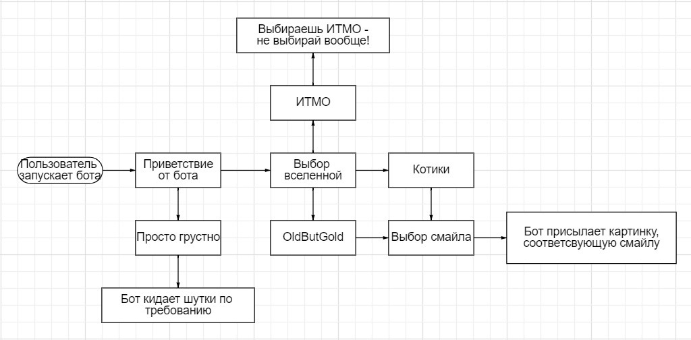
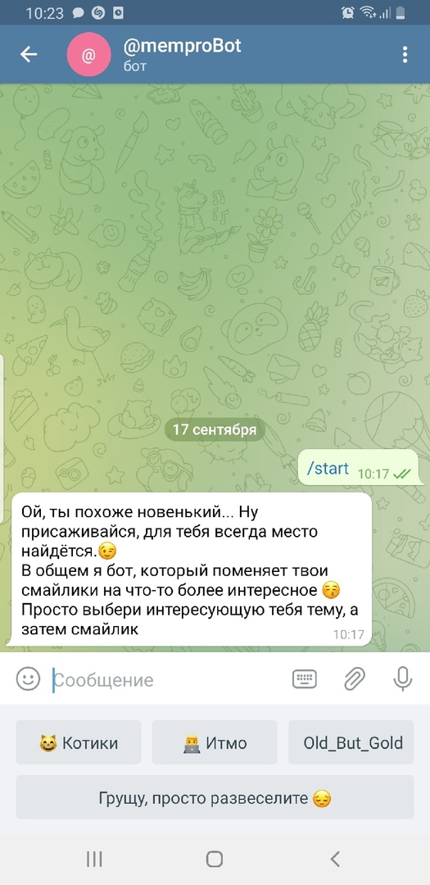
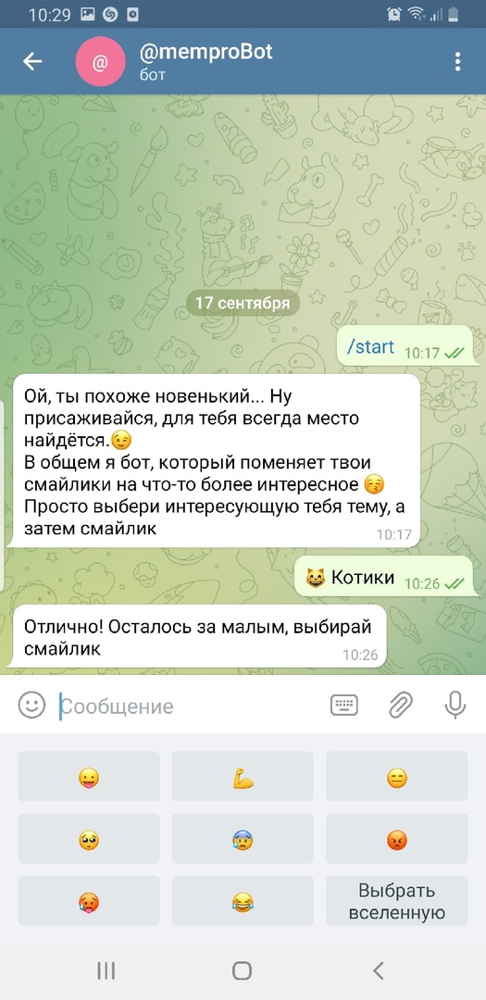

## Функциональные детали
### Группы пользователей
* Игрок - рядовой пользователь
* Администратор - отвечает за добавление новых мемов/картинок

### Пользователям доступны:
* Выбор вселенной, из которой будут картинки
* Замена смайла на фото(удобно, когда необходимо использовать картинку для важных переговоров, а она потерялась в недрах памяти телефона)
* Шутки по запросу для поднятия настроения

### Схема взаимодействия пользователя с ботом:

### Модули:
* Python 3.9
* Aiogram
* Telegram Bot API

### Интерфейс взаимодействия

### План выполнения
* Бот-попугай
* Создать вселенные
* Добавить меню
* Написать алгоритм замены смайлов на картинки
* Добавить картинки вместо пробок
* Создать и наполнить картинками рубрику "развеселите меня"
